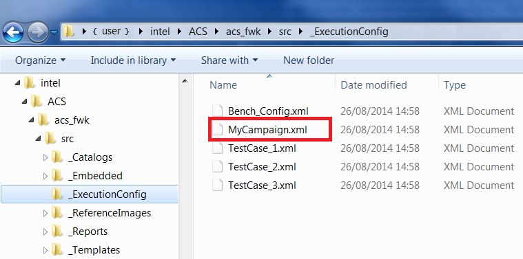
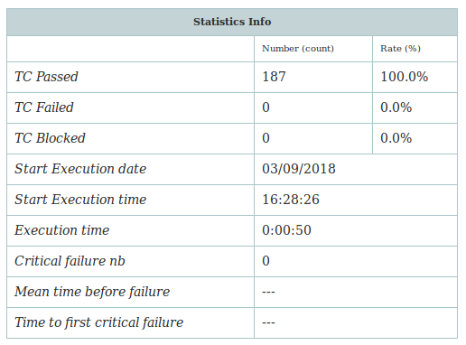
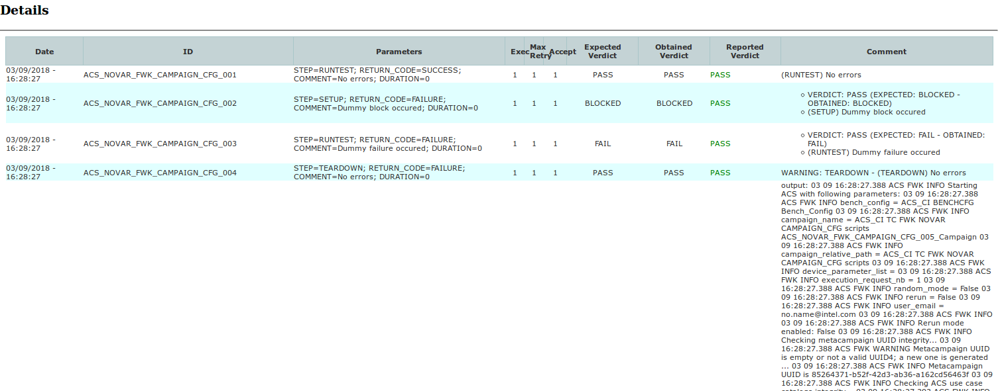

## Fundamental Concepts
* `bench` - set of one host, equipments and devices
* `device` - object to be tested (DUT / SUT)
* `host` - computer running ACS engine
* `equipment` - object necessary to do a test (relay card, power supply, network simulator, ...)
* `campaign` - set of test cases
* `test case` - test itself, based on a parametrized use case and/or test steps
* `use case` - python script defining the behavior and the sequence of the test
* `test step` - smallest functional unit to do an action required for testing

### Code structure
* `acs` : ACS framework
* `acs_release_management` : the tools used for packaging & documenting ACS project
* `acs_test_scripts` : contains the implementation of the tests (scripts, python Use Cases, XML Test Cases, Equipment managers, Device modules, Test Steps), the catalogs (Device, Equipment, Test Step, Use Case)
* `acs_test_suites` : contains the test campaigns definition, the bench configurations
* `docs`: document about this project

## Getting Started


### Configure ACS Execution

To run tests, ACS needs 3 files:

* **Bench_Config.xml**: This file describes the bench setup (DUT, equipments, etc.). See [BenchConfig File](Bench.md) for details about its content.
* **Campaign.xml**: This file describes the test plan. See Test [Campaign Definition](Campaign.md) for details about campaigns.
* **TestCase.xml**: This file describes one test scenario. For each test case declared in Campaign.xml, a test case xml file is necessary. See [Test Case Definition](TestCase.md) for details about test cases.

These files should put inot **ExecutionConfig** folder. By default, it is set to `acs/acs/_ExecutionConfig`, but you can override it by:
```
export ACS_EXECUTION_CONFIG_PATH=~/YOUR_CUSTOMIZED_PATH
```

Example:



Here is the content of *MyCampaign.xml* displayed in the picture above:

```xml
<Campaign>
  ...
  <TestCases>
    <TestCase Id="TestCase_1"/>
    <TestCase Id="TestCase_2"/>
    <TestCase Id="TestCase_3"/>
    <TestCase Id="TestCase_1"/>
  </TestCases>
</Campaign>
```

### Running ACS
The python script `ACS.py` is the entry point to execute ACS. It is located at `acs/acs/ACS.py`

#### Execute a Campaign
Once you setup as previews section, you can simply launch ACS with:
```bash
cd acs/acs
acs/acs $ python ACS.py -c MyCampaign
```

**Note**:
To quickly validate your setup, you can launch a *Dummy* campaign. Just add the Dummy Test Case in your Test Cases list.

The Dummy Test Case template is available at `acs/acs/_Templates/TestCases/DUMMY_Template.xml`.


#### Frequently used parameters
Parameter|Description
-------|---------
**-c** | Defines the campaign file path (without extension), relative to *_Execution_Config* folder. This is a **mandatory** option: ACS won’t run if it is not defined properly.
**-b** | Defines the [BenchConfig File](Bench.md) to use, relative to *_Execution_Config* folder. By default, ACS searches for `_Execution_Config/Bench_Config.xml`. This option makes possible the use of another path/filename.
**-d** | Defines the *Device Model* to use, it can override the config in BenchConfig.

#### Possible Parameters
To see all possible parameters, use `--help`option.

```bash
$ python ACS.py --help
Usage: ACS.py -h

Options:
  -h, --help            show this help message and exit

  MANDATORIES:
    -c TEST_CAMPAIGN, --campaign=TEST_CAMPAIGN, --cp=TEST_CAMPAIGN
                        Campaign file to execute.

  OPTIONS:
    -d DEVICE_MODEL, --device_model=DEVICE_MODEL, --dm=DEVICE_MODEL
                        Device model under test. To use ACS in multiple
                        devices mode, either set this option as 'multi' or
                        ignore it (-d option) and in both cases define your
                        devices in the Bench Config file.

    -b BENCH_CONFIG, --bench_config=BENCH_CONFIG, --bc=BENCH_CONFIG
                        Bench Config file to use. [default: Bench_Config].
    -n NUMBER, --run_nb=NUMBER, --nb=NUMBER
                        Campaign execution iteration number if more than one
                        run is required.
    -r, --random_mode   Enable random mode if your campaign is configured to
                        run random TC.
    -s SERIAL_NUMBER, --device_id=SERIAL_NUMBER, --sr=SERIAL_NUMBER
                        Serial number of the DUT (used to identify it when
                        communicating with it)
    --rf=REPORT_FOLDER, --report_folder=REPORT_FOLDER
                        Folder where ACS report will be created
    -o DEVICE_PARAMETER=DEVICE_VALUE, --override_device_parameter=DEVICE_PARAMETER=DEVICE_VALUE, --op=DEVICE_PARAMETER=DEVICE_VALUE
                        Override device parameters defined in both
                        Bench_Config and Device_Catalog. The user can modify
                        several parameters at the same time, as follow : -o
                        monkeyPort="80" -o bootTimeout="10" -o
                        serialNumber="12345678"


  MISCS:
    --device_models     List the supported device models.
    --eft, --extract_failed_tests
                        Auto generates a campaign with only failed tests from
                        input results folder.
    -v, --version       Print the current ACS Version.

```

### Execution Results
ACS returns the campaign execution’s result as a pair containing verdict and device’s status.

Verdict of the Campaign | Status of DUT
-------|-------
SUCCESS | ON (Main OS)
FAILURE | OFF
| NC (No Charge)
| UNKNOWN

Verdict will be **SUCCESS**, if all campaign’s test cases are executed and passed.

Verdict will be **FAILURE**, if one of the following statements applies:

* Failure of at least one test case
* Failure in ACS cleanup
* User interruption
* Critical failure
* Unknown exception

Example of ACS log output:
```
03/09 16:29:16.935	ACS             FWK	  MINIMAL	---EXECUTION METRICS---
03/09 16:29:16.935	ACS             FWK	  MINIMAL	Tests Number = 187
03/09 16:29:16.935	ACS             FWK	  MINIMAL	Passed       = 187
03/09 16:29:16.935	ACS             FWK	  MINIMAL	DUT Boot(s)  = 1
03/09 16:29:16.935	ACS             FWK	  MINIMAL	Exec Time    = 00:00:50
03/09 16:29:16.935	ACS             FWK	  MINIMAL	Local Report = acs/acs/_Reports/2018-09-03_16h28.26.9_Dummy_ACS_NOVAR_LIN_Campaign/2018-09-03_16h28.26.9_Dummy.xml
ACS OUTCOME: SUCCESS
```

##### Reports Folder
ACS campaign execution provides test results, execution logs and device logs in `_Reports`
```
acs/acs$ ls _Reports/ 
2018-09-03_16h28.26.9_Dummy_ACS_NOVAR_LIN_Campaign
2018-09-03_16h28.26.9_Dummy_ACS_NOVAR_LIN_Campaign.zip
```

Report files:
```
acs/acs/_Reports/2018-09-03_16h28.26.9_Dummy_ACS_NOVAR_LIN_Campaign$ls -1
2018-09-03_16h28.26.9_Dummy_debug.xml  # debug report, contains FAILED/BLOCKED test cases
2018-09-03_16h28.26.9_Dummy.log  # ACS log of this execution
2018-09-03_16h28.26.9_Dummy.xml  # report file, open with Firefox browser
report.xsl
teststepTestResult.xml
```

##### Test Report
A xml report will created in Report folder, with `.xml` extensiton.

This file contains Execution Statistics


and detail Test Case result 

